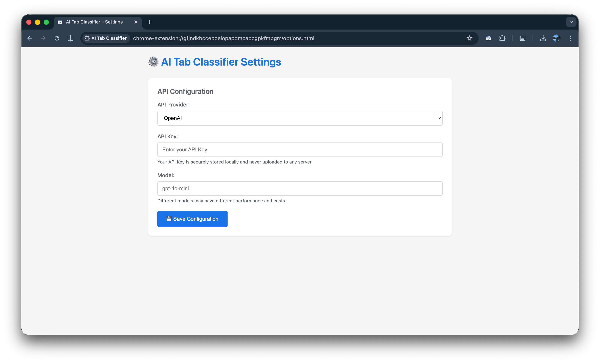

# AI Tab Classifier

Automatically organize and group your browser tabs using AI-powered classification. Keep your workspace tidy with intelligent tab grouping based on content themes.

## Features

✨ **AI-Powered Classification** - Automatically analyzes and groups tabs by content theme  
🎯 **One-Click Organization** - Simply click the extension icon to classify all ungrouped tabs  
🌐 **Multi-Language Support** - Group names adapt to your Chrome display language  
🔒 **Privacy-First** - All processing happens locally or through your chosen AI provider  
⚡ **Multiple AI Providers** - Supports OpenAI, Anthropic Claude, and Google Gemini

## Supported AI Providers

- **OpenAI** - GPT-4o-mini and other models
- **Anthropic Claude** - Claude 3.5 Haiku and other models
- **Google Gemini** - Gemini 2.0 Flash and other models

## Usage

## Install

Click the link below to install the plugin.

[Go to Chrome Web Store](https://chromewebstore.google.com/detail/plbfldpklbmelkkdjhgjmilnpfaljfod?utm_source=item-share-cb)

### Quick Start

1. **Left-click** the extension icon to instantly classify all ungrouped tabs
2. **Right-click** for additional options:
   - 🎯 Classify Tabs with AI
   - 📋 Ungroup All Tabs
   - ⚙️ Settings

### Configuration

1. Click the ⚙️ Settings option or right-click → Settings
2. Select your preferred AI provider
3. Enter your API credentials
4. Customize model settings if needed
5. Click Save

## How It Works

1. The extension collects titles and URLs of all ungrouped tabs
2. Sends them to your chosen AI provider for analysis
3. AI categorizes tabs into logical theme-based groups
4. Creates color-coded tab groups with descriptive names
5. Preserves existing tab groups and only organizes ungrouped tabs

## Status Indicators

The extension icon badge shows real-time status:

- **...** (Blue) - Processing classification
- **✓** (Green) - Successfully classified tabs
- **✗** (Red) - Error occurred (check console for details)
- *No badge* - Idle, ready to classify

## Privacy & Security

- Tab data is only sent to your configured AI provider
- API keys are stored locally using Chrome's secure storage
- Each provider's configuration is stored separately
- No data is sent to third parties

## Permissions

Completely clean, no permissions required to read any web page content!

## Development

### Building

No build step required. The extension uses vanilla JavaScript and can be loaded directly into Chrome.

## Troubleshooting

**"Tabs can only be moved to and from normal windows" error:**
- Tab groups only work in normal browser windows
- Not supported in popup windows, app windows, or DevTools

**"Please configure API Key" message:**
- Open Settings and configure your AI provider credentials

**Classification seems incorrect:**
- Try different AI models for better results
- Check that tab titles and URLs are descriptive
- Some pages may not classify well due to generic titles

## Contributing

Contributions are welcome! Please feel free to submit pull requests or open issues for bugs and feature requests.

## License

MIT License - feel free to use and modify as needed.

## Links

- Homepage: https://mileomni.com
- Repository: https://github.com/voidyuu/ai-tab-classifier

---

Made with ❤️ for better browser organization
